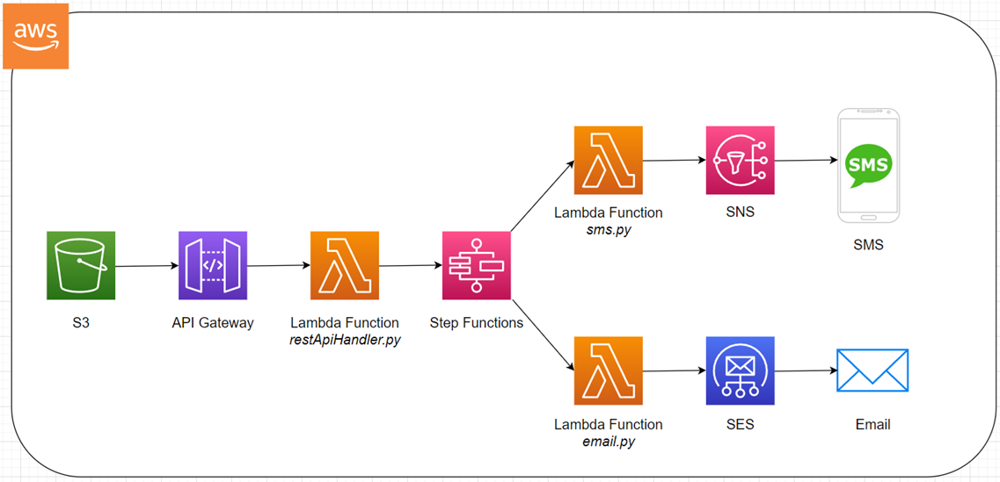
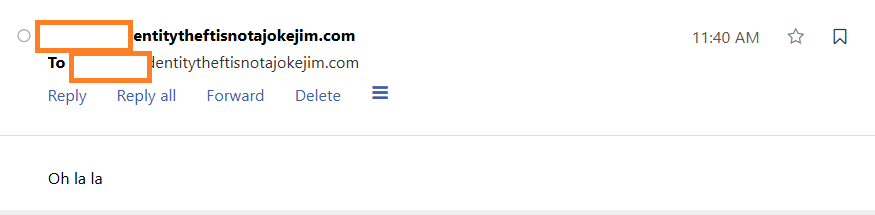
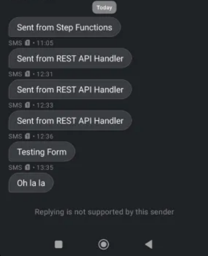

# 📡 Serverless Sending App on AWS  
**Based on cloudisfree.com**  

## ✨ What This Does  
Built a way to send emails and texts straight from a website without managing any servers. Everything runs on AWS services.  

## 🛠️ How It Works  
  

The pieces:  
- 🌐 Website lives in an S3 bucket  
- 🔌 API Gateway handles the requests  
- λ Lambda does the actual work  
- 🔄 Step Functions coordinate everything  
- ✉️ SES sends emails  
- 📱 SNS handles texts  

## 🧰 What I Used  
- **🌐 Website Hosting**: AWS S3  
- **🔌 REST API Stuff**: API Gateway  
- **λ Server Code**: Lambda functions  
- **🔄 Workflow**: Step Functions  
- **✉️ Emails**: SES  
- **📱 Texts**: SNS  

## 🚀 How I Built It  

### 1️⃣ Made the Website  
- Simple HTML frontend in S3  
- Form that takes email and phone number  
- Sends data to my API when submitted  

### 2️⃣ Set Up the API  
- Made two endpoints:  
  - ✉️ One for emails  
  - 📱 One for texts  
- Connected both to Lambda  

### 3️⃣ Wrote the Lambda Code  
**For emails**:  
- Takes the form data  
- Sends via SES  

**For texts**:  
- Sends via SNS  

### 4️⃣ Added Step Functions  
This makes sure:  
- ✅ Emails and texts send properly  
- 📝 Everything gets logged  

### 5️⃣ Configured SES & SNS  
**For SES**:  
- Verified my email domain  

## 🧪 Testing It Out  
- Sent test emails and texts to myself  

**📸 Screenshots**:  
### ✉️ Email Received  
  

### 📱 SMS Received  
  

## 💭 Final Thoughts  
This works really well for:  
- 📝 Simple contact forms  
- 🔔 Notification systems  
- 📨 Anywhere you need to send messages  

🔮 Could add later:  
- 📊 Tracking delivery status  
- 📎 Support for attachments  
- 📈 Analytics dashboard  
